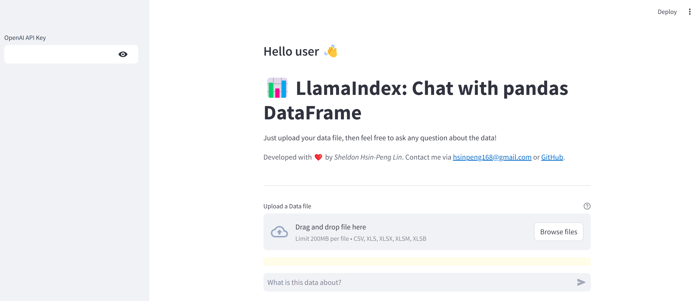

# LlamaIndex: Chat with Pandas DataFrame
This application leverages OpenAI's language models, the pandas data analysis library, and LlamaIndex's agents and tools to provide users with real-time qualitative data analysis and insights of the upload file. 



## Python Libraries
This application is powered by several libraries:
- [Streamlit](https://streamlit.io/): For the User Interface 🖥️
- [Pandas](https://pandas.pydata.org/): For performing data analysis 📊
- [LlamaIndex](https://www.llamaindex.ai/): For creating LLMs agents and tools 🔗
- [OpenAI](https://openai.com/): The Large Language Models (LLM) provider 🧠

# Getting started 🏁

## Requirements

The [Python Runtime Environment](https://www.python.org/) should be installed on your computer.
Please choose the latest version of Python 3. The tested Python version is 3.10.12 on Ubuntu 22.04.5 LTS.


## Installation

Clone the repository and install the dependencies:

```bash
git clone [this repository]
cd LlamaIndex-Chat-with-pandas-DataFrame
python3 -m pip install -r requirements.txt
```

## Run the application

```bash
streamlit run chat_pandas_df_llamaindex.py
```

# Usage 📖

Thanks to the graphical user interface, the usage of this application is pretty tuitive. 🤓

1. Paste your OpenAI key on the sidebar. The key won't be stored in anywhere. 🚫
2. Upload your data file. We only support CSV, XLS, XLSX, XLSM, and XLSB file types with 200MB size limitation. 📂
3. Enter your query text about the data file or even unrelated question. ❓
4. The LLM agent will perform data analysis by tool calling or directly anwser your question based on your query text and data file. 💡

Note: If you don't have a suitable data file. [Sample datasets](https://github.com/hsinpeng/sample_datasets.git) is provided on my github as well.

# Features ✨
- Natural language interface for automatic data analyzing by LLM agent and tools. 📊
- Support variouse file types fo dataset. 📄
- Implementation of LlamaIndex. (Note that most of the related projects are developed by LangChain) 👍

# Limitations ⚠️
- Cannot deal with non-tabular data, or extract tabular data from unsupported file types. 💔
- Cannot perform a data analysis on large datasets since the LLM has its token limitation. 🚫
- The data is not cached and the analysis report as well. 🔄

# Improvements 🚀
- Voice interface: Convert user's speech to text and perform a data analysis 🗣️
- Third-party's data sources: Integrating internal and external data without file uploading 🤝
- Perform intermediates checkings on the results to avoid LLM bias 🤔
- Handle larger datasets 📚

# Background 🧑‍🎓
My name is [Sheldon Hsin-Peng Lin](https://www.linkedin.com/in/sheldon-hsin-peng-lin-51306685/). I'm a software engineer and a research staff. I build various applications in telecommunication industry. 👨‍🔧
Since LLMs are really good at understanding human semantics, and an agent can perform data analysis by LLM reasoning and tool calling. 📚
This application is developed based on the above conditions, and I hope it can help you as well. 👍

# Acknowledgements 🙏
The application is greatly inspired by [LangChain Streamlit agent examples](https://github.com/langchain-ai/streamlit-agent/blob/main/streamlit_agent/chat_pandas_df.py). ❤️
